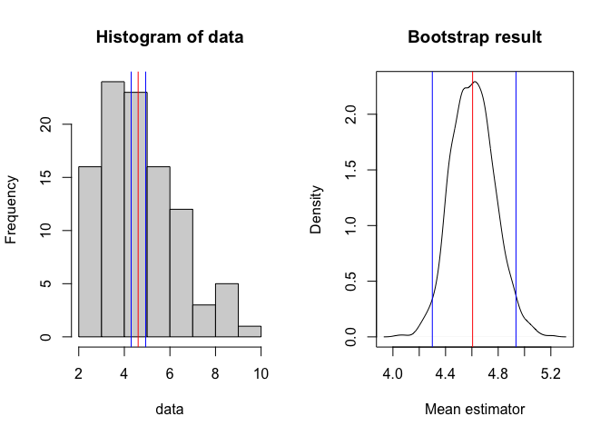

<!-- README.md is generated from README.Rmd. Please edit that file -->

# kyLogND

<!-- badges: start -->

<!-- badges: end -->

kyLogND is a set of utility functions to easily manipulate log normal
distribution.

## Installation

You can install the development version from
[GitHub](https://github.com/) with:

``` r
# install.packages("devtools")
devtools::install_github("kenyam1979/kyLogND")
```

## Utility functions in kyLogND

  - histLogND
  - normalityCheckLogND
  - meanIntervalLogND
  - rlnorm2
  - convertLogToMean
  - convertLogToSD

`histLogND` draws histograms of the original distribution and log
converted distribution with their mean and median.

``` r
library(kyLogND)

logND <- rlnorm2(100, mean=5, sd=2)
histLogND(logND)
```


`normalityCheckLogND` checks the normality of log transformed
distribution using QQ-plot and Shaprio test.

``` r
normalityCheckLogND(logND)
```


    #> 
    #>  Shapiro-Wilk normality test (null hypothesis: data is ND)
    #> 
    #> data:  data.log
    #> W = 0.98634, p-value = 0.3949

`meanIntervalLogND` calculates the interval estimate of mean for log
normal distribution using Bootstrap.

``` r
meanIntervalLogND(logND, graphic=TRUE)
```



    #>     2.5%      50%    97.5% 
    #> 4.918698 5.275075 5.676393
