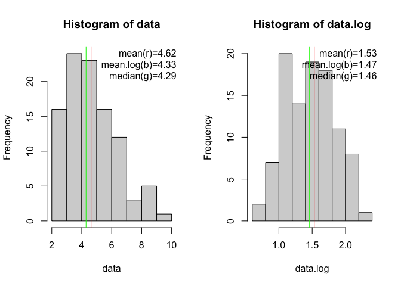

<!-- README.md is generated from README.Rmd. Please edit that file -->

# kyLogND

<!-- badges: start -->

<!-- badges: end -->

kyLogND is a set of utility functions to easily manipulate log normal
distribution.

## Installation

You can install the development version from
[GitHub](https://github.com/) with:

``` r
# install.packages("devtools")
devtools::install_github("kenyam1979/kyLogND")
```

## Utility functions in kyLogND

  - histLogND
  - normalityCheckLogND
  - rlnorm2
  - convertLogToMean
  - convertLogToSD

<!-- end list -->

``` r
library(kyLogND)

logND <- rlnorm2(1000)
histLogND(logND)
```



``` r
#logND <- rlnorm2(1000)
#normalityCheckLogND(logND)
```
